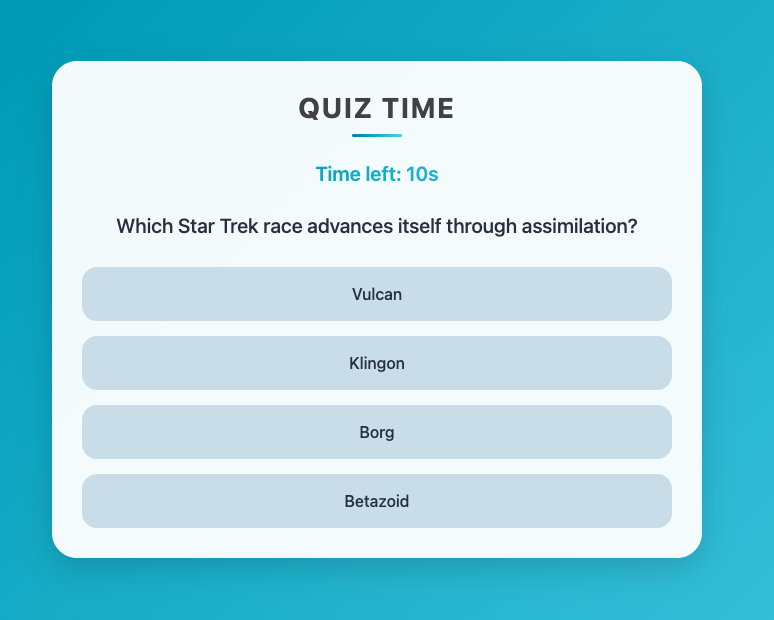

# 🎉 QuizTime - een interactieve quiz!

Welkom bij **QuizTime**! In dit project bouwen we een dynamische quizapp waarbij quizvragen automatisch worden opgehaald via een API. Volg de stappen hieronder om de statische webpagina stap voor stap om te bowuen tot een interactieve dynamische webapplicatie. 🚀

<p align="center">
  
  
</p>

---

## 📥 Downloaden en openen

1. Klik rechtsboven op de groene knop **Code**
2. Kies **Download ZIP**
3. Pak het gedownloade ZIP-bestand uit
4. Open de map in **Visual Studio Code**
5. Start een live server: **Rechterklik op index.html > Open with Live Server**
6. De webpagina opent automatisch in je browser! 🎉

---

## 🏗️ Aan de slag

Momenteel is de webapp nog statisch en kan je nog niet echt quizen. In de volgende stappen maken we de app interactief! 📊

Maar eerst hebben we quizvragen nodig... 

---

## 🔗 Quizvragen ophalen via API

We zullen de quizvragen **niet** zelf bedenken, maar ophalen via een API.

1. Ga naar [**Open Trivia Database**](https://opentdb.com/api_config.php)
2. Vul het formulier is:
   - **Number of Questions:** 5
   - **Category:** Kies je zelf 📚
   - **Difficulty:** Kies je zelf 🎚️
   - **Type:** Multiple Choice 🔢
   - **Encoding:** Default ⚙️
3. Klik op **Generate API URL** en kopieer de URL
4. Plak deze URL in een nieuw browser-tabblad en bekijk de JSON-uitvoer

💡 één quizvraag ziet er zo uit:

```json
{
    "type": "multiple",
    "difficulty": "easy",
    "category": "Entertainment: Television",
    "question": "Which Star Trek race advances itself through assimilation?",
    "correct_answer": "Borg",
    "incorrect_answers": [
        "Vulcan",
        "Betazoid",
        "Klingon"
    ]
}
```

5. Plak de API-URL op de juiste plaats in `index.html`e ✍️
6. Open de browser-console (**F12 > Console**) en controleer of de vragen correct worden opgehaald

---

## 🖥️ Vraag weergeven op de pagina

De opgehaalde vragen moeten **op de webpagina** worden getoond in plaats van een hardcoded vraag. 📝

1. Verwijder de inhoud van de `<div id="question">`
2. Pas de functie `displayQuestion()` aan:
   - Zorg ervoor dat je in het if-statement het element met het id "question" kan opvragen (tip: `document.getElementById()`) 
   - vervang de `textContent`van dit element met de huidige vraag uit de array `questions`. Gebruik de `questionIndex` om de huidige (eerste) vraag uit de array op te halen.
3. **Test de pagina** door te refreshen! 🔄

---

## 🔢 Mogelijke antwoorden weergeven

We willen de 4 mogelijke antwoorden als knoppen onder de vraag tonen. 🏆

1. Bekijk het hardcoded voorbeeld in `<div id="answers">`
2. Verwijder de inhoud van deze `div`
3. Gebruik JavaScript om dynamisch voor ieder mogelijk answer een knop aan te maken en toe te voegen:
   - Gebruik `document.createElement("button")` om een `<button>`element aan te maken.
   - Zet via `textContent` het antwoord op de knop
   - Voeg de CSS-class `answer` toe
   - Gebruik `appendChild()` om de knoppen in de `<div id="answers">` te plaatsen
4. **Test of de antwoorden correct verschijnen** 🧐

---

## ✅ Antwoord controleren

Wanneer je een antwoord kiest, moet dit gecontroleerd worden. 👀

1. Helemaal onderaan in `<script>` staat een **click-eventlistener** die luistert op welke button werd geklikt
2. De functie `checkAnswer(answer)` wordt aangeroepen bij een klik waarbij het gekozen antwoord wordt meegegeven als parameter
3. Vul de functie `checkAnswer()` verder aan:
   - Voeg de CSS-class `correct` toe aan de `classlist` van de button die het correcte antwoord bevat ✅
   - Voeg de CSS-class `incorrect` toe aan de `classlist` van de button als het verkeerde antwoord werd aangeklikt ❌
   - **Score bijhouden:** Verhoog `score` als het gegevens antwoord (parameter `answer`) correct is 🎯

**Wat gebeurt er na het antwoorden?** 🤔

- `questionIndex` wordt verhoogd
- `displayQuestion()` wordt opnieuw aangeroepen om de volgende vraag te tonen

```js
setTimeout(() => {
    questionIndex++;
    displayQuestion();
}, 1500);
```

💡 **Vraag:** Wat is het doel van `setTimeout()` hier precies? 🕒

---

## ⏳ Tijdslimiet instellen

De quiz moet **spannender** worden! 🚀 Voeg een timer toe die aftelt van **10 naar 0**.

1. Roep de functie `resetTimer()` aan **na het tonen van een nieuwe vraag**

Als de tijd op 0 komt zal:
   - `questionIndex` verhoogd worden
   - De volgende vraag getoond worden 🏃‍♂️

---

🏆 Eindscore tonen

Op het einde van de quiz wordt geen nieuwe vraag gesteld, maar zal de else-tak van de functie `displayQuestion()` worden uitgevoerd. Hier tonen we de behaalde score! 🎯

Maak dit onderdeel dynamisch:
1. Bereken het behaalde percentage 📊
2. Pas de achtergrondkleur en categorie aan op basis van de score:
    - 80% of meer → Categorie: Expert 🏅 (Groene achtergrond: `#28a745`)
    - 60% of meer → Categorie: Gevorderd 🏆 (Oranje achtergrond)
    - Minder dan 60% → Categorie: Beginner 🐣 (Rode achtergrond)

---

## 🎯 QuizTime!

De basis van je quiz werkt! Test alles uit en kijk of de vragen en antwoorden correct worden geladen en verwerkt. 🚀

Veel quizplezier! 🏆✨


